  

<h2 align="center">About Me</h2>

  Full Stack Web Developer focused on building scalable, secure and user-friendly web applications.

  🔥 MERN Stack &nbsp;•&nbsp; 🤖 AI Integration &nbsp;•&nbsp; 🔐 Authentication &nbsp;•&nbsp; 🧠 DSA

<h3>🔥 Tech I work with:</h3>

  <strong>Languages:</strong> JavaScript (ES6+), TypeScript, HTML5, CSS3. 
  <strong>Frontend:</strong> React.js, Next.js, Tailwind CSS, Redux Toolkit, React Router. 
  <strong>Backend:</strong> Node.js, Express.js, REST APIs, JWT Authentication. 
  <strong>Database:</strong> MongoDB, Mongoose, MySQL. 
  <strong>Tools &amp; Platforms:</strong> Git, GitHub, Postman, Bruno. 
  <strong>Core Concepts:</strong> Data Structures &amp; Algorithms, Object-Oriented Programming.

  
  &nbsp;
  
  &nbsp;
  
  &nbsp;
  
  &nbsp;
  
  &nbsp;
  
  &nbsp;
  
  &nbsp;
  
  &nbsp;
  
  &nbsp;
  
  &nbsp;
  
  &nbsp;
  
  &nbsp;
  
  &nbsp;
  
  &nbsp;
  
  &nbsp;
  
  &nbsp;
  

<h2>🚀 Currently Doing</h2>

<ul>
  <li>🔥 Daily DSA practice</li>
  <li>💻 Building full-stack and AI-integrated projects</li>
  <li>📚 Improving backend architecture and system design</li>
</ul>

  <strong>🚀 Build · Learn · Solve · Improve</strong>

